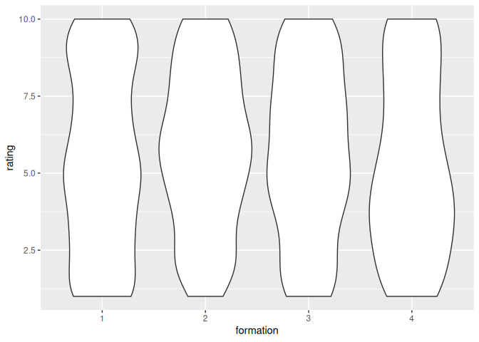

In this document, we do the analysis presented in the paper.

Currently, the analysis uses fake data.

## Setup

    library(testthat)

## Reading the data

    ratings <- readr::read_csv("ratings.csv", show_col_types = FALSE)
    n_ratings <- nrow(ratings)

There are 1000 ratings.

## Analysis

Connecting the ratings to the formations:

    songs <- dplyr::select(heyahmama::get_songs(), cd_title, song_title)
    n_songs <- nrow(songs)

There are 270 songs.

    cds <- dplyr::select(heyahmama::get_cds(), cd_title, formation)
    n_cds <- nrow(cds)
    n_formations <- length(unique(cds$formation))

There are 22 CDs.

    songs_per_formation <- dplyr::select(merge(songs, cds), song_title, formation)
    testthat::expect_equal(n_songs, nrow(songs_per_formation))
    knitr::kable(head(songs_per_formation))

<table>
<thead>
<tr class="header">
<th style="text-align: left;">song_title</th>
<th style="text-align: right;">formation</th>
</tr>
</thead>
<tbody>
<tr class="odd">
<td style="text-align: left;">10.000 luchtballonnen</td>
<td style="text-align: right;">3</td>
</tr>
<tr class="even">
<td style="text-align: left;">Kusjessoldaten</td>
<td style="text-align: right;">3</td>
</tr>
<tr class="odd">
<td style="text-align: left;">Als het binnen regent</td>
<td style="text-align: right;">3</td>
</tr>
<tr class="even">
<td style="text-align: left;">Jodelee</td>
<td style="text-align: right;">3</td>
</tr>
<tr class="odd">
<td style="text-align: left;">Kus van de juf</td>
<td style="text-align: right;">3</td>
</tr>
<tr class="even">
<td style="text-align: left;">Jij bent de bom!</td>
<td style="text-align: right;">3</td>
</tr>
</tbody>
</table>

Add the formations to the ratings:

    ratings_per_formation <- dplyr::select(merge(ratings, songs_per_formation), formation, rating)
    testthat::expect_equal(n_ratings, nrow(ratings_per_formation))
    ratings_per_formation$formation <- as.factor(ratings_per_formation$formation)
    knitr::kable(head(ratings_per_formation))

<table>
<thead>
<tr class="header">
<th style="text-align: left;">formation</th>
<th style="text-align: right;">rating</th>
</tr>
</thead>
<tbody>
<tr class="odd">
<td style="text-align: left;">1</td>
<td style="text-align: right;">9</td>
</tr>
<tr class="even">
<td style="text-align: left;">1</td>
<td style="text-align: right;">1</td>
</tr>
<tr class="odd">
<td style="text-align: left;">1</td>
<td style="text-align: right;">7</td>
</tr>
<tr class="even">
<td style="text-align: left;">1</td>
<td style="text-align: right;">2</td>
</tr>
<tr class="odd">
<td style="text-align: left;">3</td>
<td style="text-align: right;">1</td>
</tr>
<tr class="even">
<td style="text-align: left;">3</td>
<td style="text-align: right;">1</td>
</tr>
</tbody>
</table>

Plot:

    ggplot2::ggplot(
      ratings_per_formation,
      ggplot2::aes(x = formation, y = rating)
    ) + ggplot2::geom_violin()

Order formations by ratings:

    average_rating_per_formation <-
      ratings_per_formation |> 
      dplyr::group_by(formation) |> 
      dplyr::summarise(average_rating = mean(rating))
    testthat::expect_equal(n_formations, nrow(average_rating_per_formation))

    ordered_average_rating_per_formation <- 
      average_rating_per_formation |> 
      dplyr::arrange(dplyr::desc(average_rating))
    testthat::expect_equal(n_formations, nrow(ordered_average_rating_per_formation))

    knitr::kable(ordered_average_rating_per_formation)

<table>
<thead>
<tr class="header">
<th style="text-align: left;">formation</th>
<th style="text-align: right;">average_rating</th>
</tr>
</thead>
<tbody>
<tr class="odd">
<td style="text-align: left;">1</td>
<td style="text-align: right;">5.725441</td>
</tr>
<tr class="even">
<td style="text-align: left;">2</td>
<td style="text-align: right;">5.169312</td>
</tr>
<tr class="odd">
<td style="text-align: left;">3</td>
<td style="text-align: right;">4.473684</td>
</tr>
<tr class="even">
<td style="text-align: left;">4</td>
<td style="text-align: right;">4.192568</td>
</tr>
</tbody>
</table>

## Statistics

Do the formations have different ratings?

    n_combinations <- factorial(n_formations - 1)

There will be 6 comparisons.

    alpha <- 0.05 / n_combinations

Due to 6 comparisons, the alpha value is (`0.05` divided by 6 equals)
0.0083333.

    p_values_table <- tibble::tibble(
      a = rep(NA, n_combinations), 
      b = NA, 
      p_value = NA
    )

    i <- 1
    for (lhs in seq(1, n_formations - 1)) {
      ratings_lhs <- ratings_per_formation[ratings_per_formation$formation == lhs, ]$rating
      for (rhs in seq(lhs + 1, n_formations)) {
        ratings_rhs <- ratings_per_formation[ratings_per_formation$formation == rhs, ]$rating
        p_value <- wilcox.test(ratings_lhs, ratings_rhs, alternative = "two.sided")$p.value
        testthat::expect_true(i >= 1)
        testthat::expect_true(i <= nrow(p_values_table))
        p_values_table$a[i] <- lhs
        p_values_table$b[i] <- rhs
        p_values_table$p_value[i] <- p_value
        i <- i + 1
      }
    }
    p_values_table$is_the_same <- p_values_table$p_value > alpha
    knitr::kable(p_values_table)

<table>
<thead>
<tr class="header">
<th style="text-align: right;">a</th>
<th style="text-align: right;">b</th>
<th style="text-align: right;">p_value</th>
<th style="text-align: left;">is_the_same</th>
</tr>
</thead>
<tbody>
<tr class="odd">
<td style="text-align: right;">1</td>
<td style="text-align: right;">2</td>
<td style="text-align: right;">0.0284633</td>
<td style="text-align: left;">TRUE</td>
</tr>
<tr class="even">
<td style="text-align: right;">1</td>
<td style="text-align: right;">3</td>
<td style="text-align: right;">0.0000000</td>
<td style="text-align: left;">FALSE</td>
</tr>
<tr class="odd">
<td style="text-align: right;">1</td>
<td style="text-align: right;">4</td>
<td style="text-align: right;">0.0000000</td>
<td style="text-align: left;">FALSE</td>
</tr>
<tr class="even">
<td style="text-align: right;">2</td>
<td style="text-align: right;">3</td>
<td style="text-align: right;">0.0068141</td>
<td style="text-align: left;">FALSE</td>
</tr>
<tr class="odd">
<td style="text-align: right;">2</td>
<td style="text-align: right;">4</td>
<td style="text-align: right;">0.0012854</td>
<td style="text-align: left;">FALSE</td>
</tr>
<tr class="even">
<td style="text-align: right;">3</td>
<td style="text-align: right;">4</td>
<td style="text-align: right;">0.3212295</td>
<td style="text-align: left;">TRUE</td>
</tr>
</tbody>
</table>
