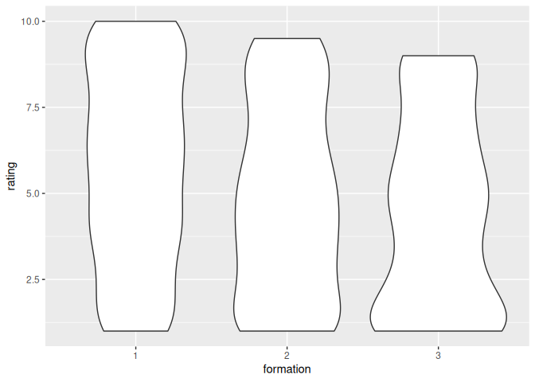

In this document, we do the analysis presented in the paper.

Currently, the analysis uses fake data.

## Setup

    library(testthat)
    library(ggsignif)

## Reading the data

    ratings <- readr::read_csv("ratings.csv", show_col_types = FALSE)
    n_ratings <- nrow(ratings)

There are 1000 ratings.

## Analysis

Connecting the ratings to the formations:

    songs <- dplyr::select(heyahmama::get_songs(), cd_title, song_title)
    n_songs <- nrow(songs)

There are 270 songs.

    cds <- dplyr::select(heyahmama::get_cds(), cd_title, formation)
    n_cds <- nrow(cds)

There are 22 CDs.

    songs_per_formation <- dplyr::select(merge(songs, cds), song_title, formation)
    testthat::expect_equal(n_songs, nrow(songs_per_formation))
    knitr::kable(head(songs_per_formation))

<table>
<thead>
<tr class="header">
<th style="text-align: left;">song_title</th>
<th style="text-align: right;">formation</th>
</tr>
</thead>
<tbody>
<tr class="odd">
<td style="text-align: left;">10.000 luchtballonnen</td>
<td style="text-align: right;">3</td>
</tr>
<tr class="even">
<td style="text-align: left;">Kusjessoldaten</td>
<td style="text-align: right;">3</td>
</tr>
<tr class="odd">
<td style="text-align: left;">Als het binnen regent</td>
<td style="text-align: right;">3</td>
</tr>
<tr class="even">
<td style="text-align: left;">Jodelee</td>
<td style="text-align: right;">3</td>
</tr>
<tr class="odd">
<td style="text-align: left;">Kus van de juf</td>
<td style="text-align: right;">3</td>
</tr>
<tr class="even">
<td style="text-align: left;">Jij bent de bom!</td>
<td style="text-align: right;">3</td>
</tr>
</tbody>
</table>

Add the formations to the ratings:

    ratings_per_formation <- dplyr::select(merge(ratings, songs_per_formation), formation, rating)
    testthat::expect_equal(n_ratings, nrow(ratings_per_formation))
    ratings_per_formation$formation <- as.factor(ratings_per_formation$formation)
    knitr::kable(head(ratings_per_formation))

<table>
<thead>
<tr class="header">
<th style="text-align: left;">formation</th>
<th style="text-align: right;">rating</th>
</tr>
</thead>
<tbody>
<tr class="odd">
<td style="text-align: left;">1</td>
<td style="text-align: right;">5</td>
</tr>
<tr class="even">
<td style="text-align: left;">1</td>
<td style="text-align: right;">4</td>
</tr>
<tr class="odd">
<td style="text-align: left;">1</td>
<td style="text-align: right;">1</td>
</tr>
<tr class="even">
<td style="text-align: left;">1</td>
<td style="text-align: right;">8</td>
</tr>
<tr class="odd">
<td style="text-align: left;">1</td>
<td style="text-align: right;">5</td>
</tr>
<tr class="even">
<td style="text-align: left;">3</td>
<td style="text-align: right;">9</td>
</tr>
</tbody>
</table>

## Formations

There are two datasets:

-   Dataset A: all 4 formations
-   Dataset B: the first 3 formations

## 4 formations

### Plot distribution of ratings

General plotting function:

    plot_ratings <- function(ratings_per_formation) {
      ggplot2::ggplot(
        ratings_per_formation,
        ggplot2::aes(x = formation, y = rating)
      ) + ggplot2::geom_violin()  
    }

Apply this to all ratings:

    p <- plot_ratings(ratings_per_formation)
    p

### Order formations based on rating

Order formations by ratings:

    get_ordered_average_rating_per_formation <- function(ratings_per_formation) {
      n_formations <- length(unique(ratings_per_formation$formation))
      
      average_rating_per_formation <-
        ratings_per_formation |> 
        dplyr::group_by(formation) |> 
        dplyr::summarise(average_rating = mean(rating))
      testthat::expect_equal(n_formations, nrow(average_rating_per_formation))

      ordered_average_rating_per_formation <- 
        average_rating_per_formation |> 
        dplyr::arrange(dplyr::desc(average_rating))
      testthat::expect_equal(n_formations, nrow(ordered_average_rating_per_formation))

      ordered_average_rating_per_formation
    }

    knitr::kable(
      get_ordered_average_rating_per_formation(
        ratings_per_formation
      )
    )

<table>
<thead>
<tr class="header">
<th style="text-align: left;">formation</th>
<th style="text-align: right;">average_rating</th>
</tr>
</thead>
<tbody>
<tr class="odd">
<td style="text-align: left;">1</td>
<td style="text-align: right;">5.730159</td>
</tr>
<tr class="even">
<td style="text-align: left;">2</td>
<td style="text-align: right;">4.876316</td>
</tr>
<tr class="odd">
<td style="text-align: left;">3</td>
<td style="text-align: right;">4.441606</td>
</tr>
<tr class="even">
<td style="text-align: left;">4</td>
<td style="text-align: right;">4.338608</td>
</tr>
</tbody>
</table>

## Statistics

Do the formations have different ratings?

General function:

    get_stats_table <- function(ratings_per_formation) {
      n_formations <- length(unique(ratings_per_formation$formation))
      n_combinations <- (n_formations * (n_formations - 1)) / 2
      alpha <- 0.05 / n_combinations

      p_values_table <- tibble::tibble(
        a = rep(NA, n_combinations), 
        b = NA, 
        p = NA,
        alpha = alpha
      )

      i <- 1
      for (lhs in seq(1, n_formations - 1)) {
        ratings_lhs <- ratings_per_formation[ratings_per_formation$formation == lhs, ]$rating
        for (rhs in seq(lhs + 1, n_formations)) {
          ratings_rhs <- ratings_per_formation[ratings_per_formation$formation == rhs, ]$rating
          p_value <- wilcox.test(ratings_lhs, ratings_rhs, alternative = "two.sided")$p.value
          testthat::expect_true(i >= 1)
          testthat::expect_true(i <= nrow(p_values_table))
          p_values_table$a[i] <- lhs
          p_values_table$b[i] <- rhs
          p_values_table$p[i] <- p_value
          i <- i + 1
        }
      }
      p_values_table$is_the_same <- p_values_table$p > alpha
      p_values_table
    }

Applying it here:

    knitr::kable(get_stats_table(ratings_per_formation))

<table>
<thead>
<tr class="header">
<th style="text-align: right;">a</th>
<th style="text-align: right;">b</th>
<th style="text-align: right;">p</th>
<th style="text-align: right;">alpha</th>
<th style="text-align: left;">is_the_same</th>
</tr>
</thead>
<tbody>
<tr class="odd">
<td style="text-align: right;">1</td>
<td style="text-align: right;">2</td>
<td style="text-align: right;">0.0008208</td>
<td style="text-align: right;">0.0083333</td>
<td style="text-align: left;">FALSE</td>
</tr>
<tr class="even">
<td style="text-align: right;">1</td>
<td style="text-align: right;">3</td>
<td style="text-align: right;">0.0000000</td>
<td style="text-align: right;">0.0083333</td>
<td style="text-align: left;">FALSE</td>
</tr>
<tr class="odd">
<td style="text-align: right;">1</td>
<td style="text-align: right;">4</td>
<td style="text-align: right;">0.0000003</td>
<td style="text-align: right;">0.0083333</td>
<td style="text-align: left;">FALSE</td>
</tr>
<tr class="even">
<td style="text-align: right;">2</td>
<td style="text-align: right;">3</td>
<td style="text-align: right;">0.0811276</td>
<td style="text-align: right;">0.0083333</td>
<td style="text-align: left;">TRUE</td>
</tr>
<tr class="odd">
<td style="text-align: right;">2</td>
<td style="text-align: right;">4</td>
<td style="text-align: right;">0.0922982</td>
<td style="text-align: right;">0.0083333</td>
<td style="text-align: left;">TRUE</td>
</tr>
<tr class="even">
<td style="text-align: right;">3</td>
<td style="text-align: right;">4</td>
<td style="text-align: right;">0.8913167</td>
<td style="text-align: right;">0.0083333</td>
<td style="text-align: left;">TRUE</td>
</tr>
</tbody>
</table>

## Plot with significance indicators

General function:

    plot_ratings_with_indicators <- function(ratings_per_formation) {
      p <- plot_ratings(ratings_per_formation)
      t_all <- get_stats_table(ratings_per_formation)
      
      t <- t_all[t_all$is_the_same == FALSE, ]
      
      t$annotation <- scales::scientific(t$p, digits = 1)
      t$y_position <- seq(
        from = 11.0, 
        to = 11.0 + ((nrow(t) - 1) * 2.0),
        by = 2.0
      )
      p + ggsignif::geom_signif(
        data = t,
        ggplot2::aes(
          xmin = a,
          xmax = b,
          annotations = annotation,
          y_position = y_position
        ),
        manual = TRUE
      )
      
    }

To these ratings

    plot_ratings_with_indicators(ratings_per_formation)
    #> Warning in ggsignif::geom_signif(data = t, ggplot2::aes(xmin = a, xmax = b, :
    #> Ignoring unknown aesthetics: xmin, xmax, annotations, and y_position

## 3 formations

    t <- ratings_per_formation[ratings_per_formation$formation != 4, ]
    p <- plot_ratings(t)
    p

    knitr::kable(
      get_ordered_average_rating_per_formation(t)
    )

<table>
<thead>
<tr class="header">
<th style="text-align: left;">formation</th>
<th style="text-align: right;">average_rating</th>
</tr>
</thead>
<tbody>
<tr class="odd">
<td style="text-align: left;">1</td>
<td style="text-align: right;">5.730159</td>
</tr>
<tr class="even">
<td style="text-align: left;">2</td>
<td style="text-align: right;">4.876316</td>
</tr>
<tr class="odd">
<td style="text-align: left;">3</td>
<td style="text-align: right;">4.441606</td>
</tr>
</tbody>
</table>

    t <- ratings_per_formation[ratings_per_formation$formation != 4, ]
    knitr::kable(get_stats_table(ratings_per_formation = t))

<table>
<thead>
<tr class="header">
<th style="text-align: right;">a</th>
<th style="text-align: right;">b</th>
<th style="text-align: right;">p</th>
<th style="text-align: right;">alpha</th>
<th style="text-align: left;">is_the_same</th>
</tr>
</thead>
<tbody>
<tr class="odd">
<td style="text-align: right;">1</td>
<td style="text-align: right;">2</td>
<td style="text-align: right;">0.0008208</td>
<td style="text-align: right;">0.0166667</td>
<td style="text-align: left;">FALSE</td>
</tr>
<tr class="even">
<td style="text-align: right;">1</td>
<td style="text-align: right;">3</td>
<td style="text-align: right;">0.0000000</td>
<td style="text-align: right;">0.0166667</td>
<td style="text-align: left;">FALSE</td>
</tr>
<tr class="odd">
<td style="text-align: right;">2</td>
<td style="text-align: right;">3</td>
<td style="text-align: right;">0.0811276</td>
<td style="text-align: right;">0.0166667</td>
<td style="text-align: left;">TRUE</td>
</tr>
</tbody>
</table>

    plot_ratings_with_indicators(t)
    #> Warning in ggsignif::geom_signif(data = t, ggplot2::aes(xmin = a, xmax = b, :
    #> Ignoring unknown aesthetics: xmin, xmax, annotations, and y_position

