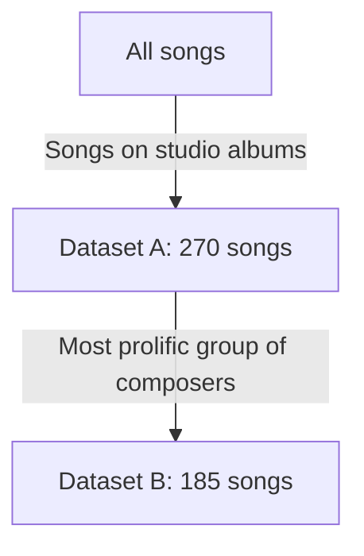

# Does perceived song quality depend on band members for same composers?

## Abstract

Some bands have had multiple formations,
while using the same composers.
What is the effect of the singers
on the perceived song quality?
This paper answers this question
for the famous Flemish music group
called K3, using song ratings as given by fans.
It was found that band members do/don't
influence the perceived quality of the song.

## Introduction

What is the effect that members of a
music band have on the perceived quality
on their songs, when these songs
are written by others?
Do the song writers adapt to the band members
in a noticable way?

This has been a burning for the Flemish music group
called K3, which is a famous Flemish/Dutch music group
that currently is in its fourth formation
and has produced 22 CDs, with mostly the
exact same group of writers.

???- question "What are the different K3 formations?"

    These are the K3 formations,
    as obtained by `heyahmama::get_formations_wide()`:

    Formation||Members
    ---------|-----------------------
    1        |Karen, Kristel,Kathleen
    2        |Josje, Karen, Kathleen
    3        |Hanne, Klaasje, Marthe
    4        |Hanne, Julia, Marthe

    > Table 1: K3 formations

This research tries to conclude if a certain formation
did better or worse.

## Hypothesis

- H1: the songs unique to each K3 formation
  have the same distribution in their ratings
- H2: the songs unique to each K3 formation
  have the same distribution in their ratings,
  if the songs compared have the same writers

## Methods

### Song selection

To select the songs used in this research,
the R package `heyahmama` is used,
which is a package containing information about K3,
including functions to easily work with the data.

Our first filter is to use only songs that are found on studio albums.
K3 produces multiple types of CDs: studio albums,
soundtrack albums, compilation albums, live albums and singles.
The songs excluded are those on soundtrack albums,
as these are not included in the `hayahmama` package
[yet](https://github.com/richelbilderbeek/heyahmama/issues/10).
Dataset A is the dataset that uses the songs present on these CDs,
which is use for hypothesis 1.

Behind all these songs have been 5 different groups of
composers, with big overlap of the composers in each group.
Dataset B is the subset of dataset A where the songs are written
by the most prolific group of composers,
which is used for hypothesis 2.

???- question "Who is in the most prolific group of K3 composers?"

    These are Alain Vande Putte, Miguel Wiels and Peter Gillis,
    as can be seen in the `heyahmama` 'Composers' vignette.

This group of composers, however, has only written songs for the first three
formations.

#### Ratings

We obtain ratings (which are values from
1 to 10, where 1 is worst and 10 is best)
from two websites in which fans
have rated K3 songs,
which are [https://github.com/richelbilderbeek/k3reviews](https://github.com/richelbilderbeek/k3reviews)
and [forum.popjustice.com](https://forum.popjustice.com/threads/its-the-k3-singles-rate.62219/).

The collected datasets can be downloaded from
[https://github.com/richelbilderbeek/paper_k3_ratings](https://github.com/richelbilderbeek/paper_k3_ratings).

### Statistical test

We do not assume that the
ratings follows a normal distribution,
as we think it is likelier that fans
rate a song with the more extreme ratings.
Additionally, we know that ratings are not unique.
Due to those statements, the Mann-Whitney U test is the correct
statistical test to use,
which tests if the distributions of ratings are the same.
As the Mann-Whitney U test makes no assumptions on the underlying
distributions, it will be rather conservative in determining if
two distributions are different.
This, on the other hand, does mean that if a difference is found,
it is undeniable that different formations have an effect on perceived
song quality.

A base value of alpha of 0.05 is used,
as there has not been done any previous research on this.
A Bonferroni correction is used to take multiple tests into consideration,
which results in an alpha value of (0.05 / 6 =) 0.0083 for dataset A (which
has 4 K3 formations)
and an alpha value of (0.05 / 3 =) 0.016666667 for dataset B (which
has 3 K3 formations).

If the p value if below that alpha value,
the formations have a significantly different ratings distributions,
meaning that the different group members have had an effect
on the perceived quality of the songs.
Else, we will conclude that the two formations
have produced songs of equal perceived quality.

We compare the distributions between all combinations of ratings,
as shown in tables 4a and 4b.

Formation A|Formation B|p-value|Are distributions the same?
---|---|---------|-----------
1|2|0.0284633|TRUE       
1|3|0.0000000|FALSE      
1|4|0.0000000|FALSE      
2|3|0.0068141|FALSE      
2|4|0.0012854|FALSE      
3|4|0.3212295|TRUE       

> Table 4a: overview of statistical tests

???- question "How did you generate these values?"

    By doing the actual analysis on simulated data.

    The simulated data is created by
    [this script](https://github.com/richelbilderbeek/paper_k3_ratings/blob/main/scripts/create_simulated_ratings.R)

We also show the distributions of the ratings:

> Fig 1a: distributions of ratings

???- question "How did you generate these values?"

    By doing the actual analysis on simulated data.

    The simulated data is created by
    [this script](https://github.com/richelbilderbeek/paper_k3_ratings/blob/main/scripts/create_simulated_ratings.R)

## Results

...

## Conclusion

From our p-value we conclude that
the groups are [equally/differently] enjoyable.

[If there is a difference, then:]
We observe in figure 1 that the [first/second]
group is more enjoyable.

## Discussion

Confounding factors are:
- composers age
- since 

The dataset used has multiple factors that weaken
it. First, users will not rate all songs.
Second, users will rate different songs.
Thirdly, users will have different distributions
on their ratings. As the dataset is quite big,
we expect these factors to average out any biases.
However, it will make it harder to observe any significant
effects.

