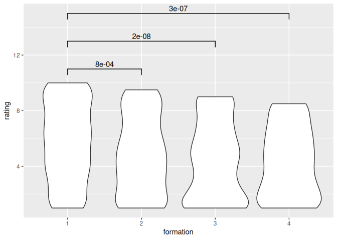

# Are members exchangable in commercial music bands? A preregistration

## Abstract

Some commercial music bands have had multiple formations,
where members are swapped by others.
Given that the goal of such a band is to
remain being a commercial success,
on can imagine that swapping members
has no effect.
In such commercial music bands,
are members exchangable?
In this preregistered research,
we answer this question
based on ratings of songs of a
famous Flemish band called K3,
which seems the perfect band to answer
this question with.
We found that K3 `is/is_not` a
perfect dataset and that there
`is an/is no` effect when
band members are swapped,
based on the perceived quality of the songs.

## Introduction

Imagine a highly commercial boy/girl band,
with all its songs being written by the same
composers and being produced by the same producers.
In such a setting, does the personality of the singers
matter at all? Or, in other words, are all members
exchangable with equally qualified artists?

There exist bands that have driven replacabability
of its members to an extreme, such as
AKB48 and Morning Musume, which have a rotational
schedule. However, imagine a steady formation of singers
that lasts several albums. Would these singers
have an imfluence?

The ideal dataset would be a band that
is highly commercial, has had produced many songs,
has had multiple artist formations, while having
the same group of composers and producers.
If, in such a band, the songs of one formation get a significantly
higher or lower ratings, than we can draw the
-maybe unexpected- conclusion that, yes,
the personality of the artists matter.

A band that is close to the ideal dataset seems
to be the Flemish bubblegum pop girl band called K3,
which is highly commercial, is currently in its fourth formation,
has produced more than twenty CDs, written by mostly the
same group of writers, produced by the same producers.


???- question "What are the different K3 formations?"

    These are the K3 formations,
    as obtained by `heyahmama::get_formations_wide()`:

    Formation|Members
    ---------|-----------------------
    1        |Karen, Kristel,Kathleen
    2        |Josje, Karen, Kathleen
    3        |Hanne, Klaasje, Marthe
    4        |Hanne, Julia, Marthe

    > Table 1: K3 formations

The members of K3 are -among others- selected for their hair color:
each formation has a singer with red, black and blond hair.
This branding is an indicator of K3 being commercial.
However, each of the three singer formations may nevertheless
have had an effect:

- The second formation had the sugarsweet Kristel replaced by the
  more naughty (Dutch!) Josje. 
  One may suspect that lyrics have
  changed along and have gotten naughtier too
- The third formation is a complete replacement from older singers
  to a new young formation of singers.
  One may suspect that lyrics have
  changed along and have gotten a new, young, fresh vibe.
- The fourth formation had Klaasje replaced by Julia.
  The reason behind this is that Klaasje wanted to focus on her
  classical career.
  Here, the melody of the songs may have changed to resemble
  the decrease in classical influences

One confounding factor that may cause the intrinsic
K3 song quality to change is, simply, time:
over time, song writers change, fans change and
the way fans rate songs changes.
This research will assume these factors of
minor importance.
To verify this assumptions,
this research will investigate if the lyrics have remained constant in time.

This research investigates if a certain K3 formation
resulted in significantly worse or better ratings.
If -maybe unexpectedly- such a formation is found, this would give the
implication that even in a highly commercial music band, the
personality of the band members matters.

## Hypothesis

- H1: the songs unique to each K3 formation
  have the same distribution in their ratings
- H2: the songs unique to each K3 formation
  have the same distribution in their ratings,
  for those songs that have the exact same group of text writers
- H3: lyrics have remained constant in time

## Methods

### Selection of songs


To select the songs used in this research,
the R package `heyahmama` is used,
which is a package containing information about K3,
including functions to easily work with the data.

Songs set A is to use all K3 songs with lyrics.
There is one song that has no lyrics and this
song is useless to our hypotheses.

???- question "Which song does not have lyrics?"

    'Oya heya' currently is the only song without lyrics,
    as performed by Josje, Karen and Kristel.

However,
K3 songs are re-used by other formations as well.
This is no problem for our hypothesis: we assume
the song is written for the first formation that
performed it. One problem with this set, is that
the singers have noticably different voices, hence
fans may rate the version with their favorite singer(s)
higher.

Song set B is to use all K3 songs that are
recorded for exactly one formation.
This removes the effect of different ratings per song,
as fans do have their favorite singers.
One problem with this set is that it is noticably smaller: 
K3 has a tendency to re-use songs and put these on a 
compilation CD or a second CD of a new release by a newer formation. 

Songs set C and D are the songs that have been written
by the most prolific group of composers.
Behind all K3 songs have been 5 different groups of
composers, with big overlap of the composers in each group.
Songs set C comprises all songs written
by the most prolific group of composers. Songs set D consists
out of the songs that are unique and are written by the same composers.
The main problem of these songs sets are, besides a reduced songs set,
that the group of most prolific composers,
has only written songs for the first three formations.
This, however, works just as fine four our hypotheses.

???- question "Who is in the most prolific group of K3 composers?"

    These are Alain Vande Putte, Miguel Wiels and Peter Gillis,
    as can be seen in the `heyahmama` 'Composers' vignette.

### Obtaining fan ratings

We obtain ratings (which are values from
1 to 10, where 1 is worst and 10 is best)
from two websites in which fans
have rated K3 songs,
which are [https://github.com/richelbilderbeek/k3reviews](https://github.com/richelbilderbeek/k3reviews)
and [forum.popjustice.com](https://forum.popjustice.com/threads/its-the-k3-singles-rate.62219/).
Ratings below one are set to one, where ratings above ten are set to ten.

Note that the author has been involved heavily with one of these resources.
However, the author has no favorite formation
and has never structurally analysed his own ratings before
the experiment of this paper. It was the author's familiarity with
the work of K3 that made him realize that it is an excellent dataset.

The collected datasets can be downloaded from
[https://github.com/richelbilderbeek/paper_k3_ratings](https://github.com/richelbilderbeek/paper_k3_ratings).

### Statistical test to compare formations

We do not assume that the
ratings follows a normal distribution,
as we think it is likelier that fans
rate a song with the more extreme ratings.
Additionally, we know that ratings are not unique.
Due to those statements, the Mann-Whitney U test is the correct
statistical test to use,
which tests if the distributions of ratings are the same.
As the Mann-Whitney U test makes no assumptions on the underlying
distributions, it will be rather conservative in determining if
two distributions are different.
This, on the other hand, does mean that if a difference is found,
it is undeniable that different formations have an effect on perceived
song quality.

A base value of alpha of 0.05 is used,
as there has not been done any previous research on this.
A Bonferroni correction is used to take multiple tests into consideration,
which results in an alpha value of (0.05 / 6 =) 0.0083 for datasets A and B
(which have 4 K3 formations)
and an alpha value of (0.05 / 3 =) 0.017 for datasets C and D (which
has 3 K3 formations).

If the p value if below that alpha value,
the formations have a significantly different ratings distributions,
meaning that the different group members have had an effect
on the perceived quality of the songs.
Else, we will conclude that the two formations
have produced songs of equal perceived quality.

We compare the distributions between all combinations of ratings,
as shown in tables 4a-4d.

???- question "How did you generate these tables?"

    By doing the actual analysis on simulated data.

    The simulated data is created by
    [this script](https://github.com/richelbilderbeek/paper_k3_ratings/blob/main/scripts/create_simulated_ratings.R)

Formation A|Formation B|p-value|Alpha value|Are distributions the same?
---|---|---------|---------|---------
1 | 2 | 0.0284633 | 0.0083333 | TRUE
1 | 3 | 0.0000000 | 0.0083333 | FALSE
1 | 4 | 0.0000000 | 0.0083333 | FALSE
2 | 3 | 0.0068141 | 0.0083333 | FALSE
2 | 4 | 0.0012854 | 0.0083333 | FALSE
3 | 4 | 0.3212295 | 0.0083333 | TRUE

> Table 4a: overview of statistical tests between all formations
> for all songs

Formation A|Formation B|p-value|Alpha value|Are distributions the same?
---|---|---------|---------|---------
1 | 2 | 0.0284633 | 0.0083333 | TRUE
1 | 3 | 0.0000000 | 0.0083333 | FALSE
1 | 4 | 0.0000000 | 0.0083333 | FALSE
2 | 3 | 0.0068141 | 0.0083333 | FALSE
2 | 4 | 0.0012854 | 0.0083333 | FALSE
3 | 4 | 0.3212295 | 0.0083333 | TRUE

> Table 4b: overview of statistical tests between all formations
> for all songs performed uniquely by one formation

Formation A|Formation B|p-value|Alpha value|Are distributions the same?
---|---|---------|---------|---------
1 | 2 | 0.0284633 | 0.0166667 | TRUE
1 | 3 | 0.0000000 | 0.0166667 | FALSE
2 | 3 | 0.0068141 | 0.0166667 | FALSE

> Table 4c: overview of statistical tests between all formations with
> the most prolific group of text writers

Formation A|Formation B|p-value|Alpha value|Are distributions the same?
---|---|---------|---------|---------
1 | 2 | 0.0284633 | 0.0166667 | TRUE
1 | 3 | 0.0000000 | 0.0166667 | FALSE
2 | 3 | 0.0068141 | 0.0166667 | FALSE

> Table 4d: overview of statistical tests between all formations with
> the most prolific group of text writers
> for all songs performed uniquely by one formation

We also show the distributions of the ratings:

???- question "How did you generate these plots?"

    By doing the actual analysis on simulated data.

    The simulated data is created by
    [this script](https://github.com/richelbilderbeek/paper_k3_ratings/blob/main/scripts/create_simulated_ratings.R)



> Fig 1a: distributions of ratings
> for all songs


> Fig 1b: distributions of ratings
> for all songs performed uniquely by one formation


> Fig 1c: distributions of ratings,
> for all songs
> for all formations with the most prolific group of text writers


> Fig 1d: distributions of ratings,
> for all formations with the most prolific group of text writers
> for all songs performed uniquely by one formation

### Songs remain the same

To determine if all songs have remained the same, even though the
composition of lyrics writer groups have sometimes changed,
topic modelling will used.

- Use R package `stylo`
- Remove Dutch stop words
- Of each song, collect the 20 most used words and their frequency
- Code this is a 20D vector
- Cluster analysis
- Determine clusters

Pilot:

- Songs from other groups


```text
TODO
```

## Results

...

## Conclusion

From our p-value we conclude that
the groups are [equally/differently] enjoyable.

[If there is a difference, then:]
We observe in figure 1 that the [first/second]
group is more enjoyable.

## Discussion

The dataset of ratings used has multiple factors that weaken
it. First, users will not rate all songs.
Second, users will rate different songs.
Thirdly, users will have different distributions
on their ratings. As the dataset is quite big,
we expect these factors to average out any biases.
However, it will make it harder to observe any significant
effects.

This research used K3 as a dataset.
The choice for this dataset is based on the
the first author being familiar with their work.
There are, however, other bands that could also
be considered, such as The Nolans, with 9 formations
and 23 studio albums could also be just as suitable.
Repeating this same experiment for such a band would
give more general insights in the effect of band
member personality on fan's song ratings.

Bands such as AKB48 and Morning Musume,
highly commercial bands that have had more formations
than CD have been considered unsuitable for this research,
as we estimate it is too likely that the personality
of the band members have an effect on song ratings by fans.
Performing this same experiment on those band and finding
such an unexpected difference between formations would
be quite an unexpected finding according to us.

